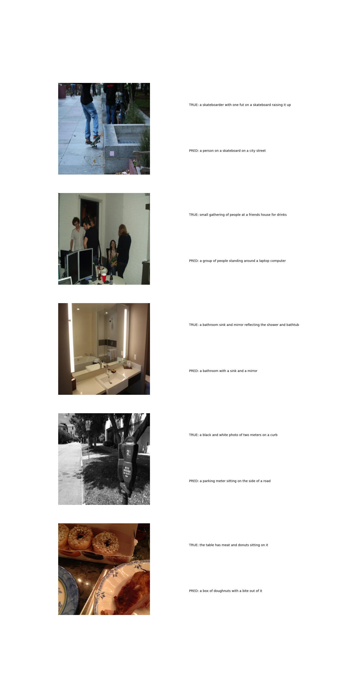

# COCO-Image-Captioning
Using transfer learning and the transformer for auto-regressive caption learning on the COCO captions dataset.

Starter code taken from: https://www.kaggle.com/code/nikhil7280/image-captioning-using-vit

# Model Architecture

EfficientNetB2 used for CNN backbone with output flattend (8,8,1408) -> (64,1408). Work embeddings take the shape (35, 786) for caption input.
Transformer trained autoregressively to predict next token in the sequence at each step.

# Sample from test set after training

